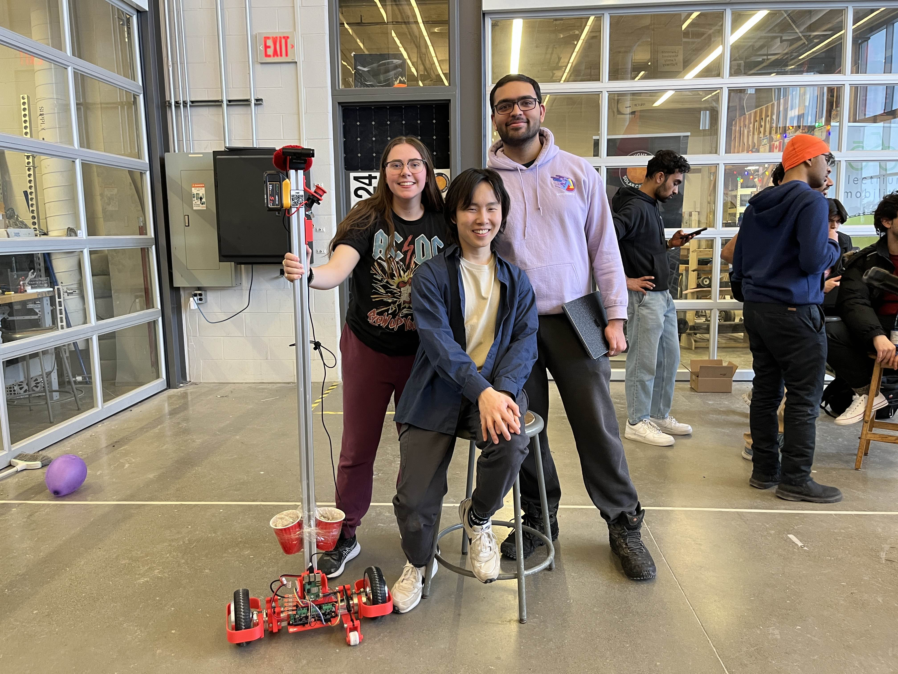

# Lane Centering Bracket Bot!

Source code for the Lane Centering [Bracket Bot](https://bracket.bot), created by team red during the Feb 7-9 2025 Bracket Bot hackathon at University of Waterloo.

## Authors

- Krish (https://github.com/Krish120003)
- Rachelle De Man (https://github.com/demanr)
- Jackie Yi (https://github.com/Luigimash)

## Why?

One of the challenges of the hackathon was to be the first team to autonomously drive a bracketbot from E6 to E3 over the bridges.

## Results

Our team (and our bracketbot) won the challenge! We were the first to successfully drive the bracketbot from E6 to E3 autonomously by using a lane detection and centering implementation. Here is a time-lapse of our bracketbot driving from E6 to E3 at ~1:40 AM on February 9th, 2025:

<video width="100%" controls>
    <source src="bracketbot_timelapse.mp4" type="video/mp4">
    Your browser does not support the video tag.
</video>

## How?

During the hackathon, we had several options for collecting environmental data:

- [Intel RealSense](https://www.intel.com/content/www/us/en/architecture-and-technology/realsense-overview.html) depth sensor for localization and mapping
- A basic Amazon webcam
- iPhone sensors (camera, GPS, or depth data)

Since RealSense cameras were limited in quantity, we opted for the webcam solution. While we attempted to utilize iPhone data, network reliability issues prevented its use for real-time operations.

After getting the data, we needed to navigate next. We researched some techniques like optical flow existed, but our team's limited experience made those techniques infeasible. The time constraints forced us to adopt, and we went with a Tesla-inspired approach: vision-based lane detection for autonomous navigation.

We developed an OpenCV-based lane detection and centering system that identifies lanes marked by red plastic cups and maintains the bracketbot's position in the center. Using the provided MQTT implementation, we sent continuous angular and linear velocity commands to keep the bracketbot centered. The implementation details can be found in [core/node_correct.py](https://github.com/Krish120003/lane-centering-bracketbot/blob/main/core/node_correct.py).

<video width="100%" controls>
        <source src="bracketbot_cv2_vision.mp4" type="video/mp4">
        Your browser does not support the video tag.
</video>

## Future Improvements

- Better code performance (keep cv2 capture open but dupm the unused frames using another thread)
- Improve accuracy by addressing physical wheel issues
- Implement advanced lane detection using neural networks or other object detection methods
- Explore iPhone sensor data again

## Thanks

Big thanks to

- [Brian for hosting](https://x.com/sincethestudy)
- [Ivan for debugging our odrive](https://x.com/ivan_yevenko)
- [Miles for the _vibes_](https://github.com/MilesPurvis)
- The other teams for the competition
- The sponsors for the prizes

---

Go follow updates for bracketbot! it's a cool project

https://bracket.bot
